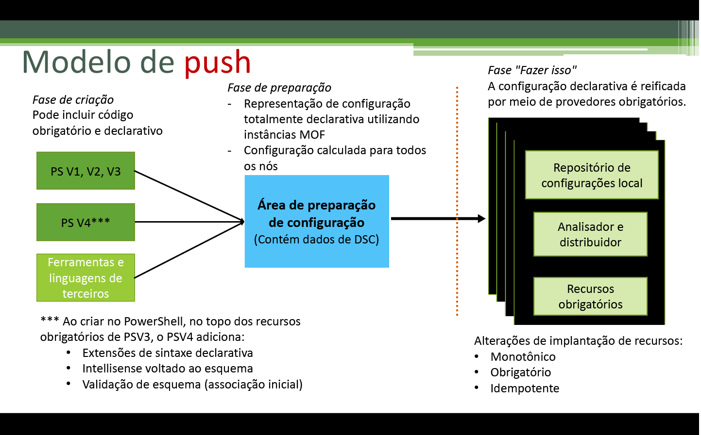
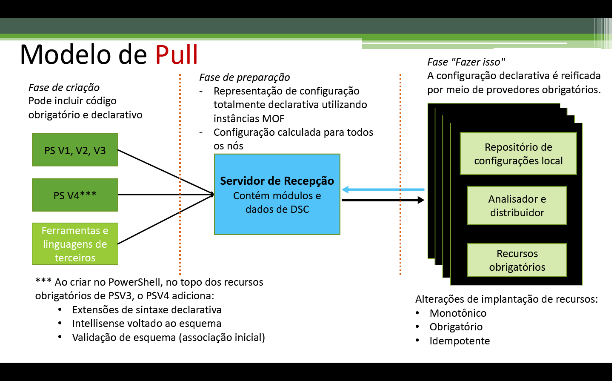

# Aplicando configurações

>Aplica-se a: Windows PowerShell 4.0, Windows PowerShell 5.0

Há duas maneiras de aplicar configurações da Configuração de Estado Desejado (DSC) do PowerShell: modo de push e modo de pull.

## Modo de push

O modo de push se refere a um usuário aplicando ativamente uma configuração a um nó de destino chamando o cmdlet [Start-DscConfiguration](https://technet.microsoft.com/en-us/library/dn521623.aspx).

Depois de criar e compilar uma configuração, você pode aplicá-la no modo de push chamando o cmdlet [Start-DscConfiguration](https://technet.microsoft.com/en-us/library/dn521623.aspx), definindo o parâmetro -Path do cmdlet para o caminho em que se encontra o MOF de configuração. Por exemplo, se o MOF da configuração estiver localizado em `C:\DSC\Configurations\localhost.mof`, você o aplicaria no computador local com o seguinte comando: `Start-DscConfiguration -Path 'C:\DSC\Configurations'`

> __Observação__: por padrão, a DSC executa uma configuração como um trabalho em segundo plano. Para executar a configuração interativamente, chame o [Start-DscConfiguration](https://technet.microsoft.com/en-us/library/dn521623.aspx) com o parâmetro __-Wait__.

## Modo de pull

No modo de pull, os clientes de pull são configurados para obter suas configurações de estado desejado de um servidor remoto de pull. Da mesma forma, o servidor de pull foi configurado para hospedar o serviço de DSC e recebeu as configurações e os recursos necessários para os clientes de pull. Cada um dos clientes de pull tem uma tarefa agendada que executa uma verificação periódica de conformidade na configuração do nó. Quando o evento é disparado na primeira vez, faz com que o Gerenciador de Configurações Local (LCM) no cliente de pull valide a configuração. Se o cliente de pull estiver configurado como desejado, nada acontecerá. Caso contrário, o LCM faz uma solicitação para o servidor de pull para obter uma determinada configuração. Se essa configuração existir no servidor de pull e passar nas verificações iniciais de validação, ela será transmitida para o cliente pull, no qual será executada pelo LCM.

Para obter mais informações sobre como implantar um Servidor de Pull de DSC localmente, consulte o Guia de Planejamento e Configuração de Servidores de Pull de DSC.

Se preferir tirar proveito de um serviço online para hospedar a funcionalidade de Servidor de Pull, consulte o serviço de [DSC de Automação do Azure](https://azure.microsoft.com/en-us/documentation/articles/automation-dsc-overview/).

Os tópicos a seguir explicam como configurar clientes e servidores de pull:

- [Configurando um servidor de pull da Web](pullServer.md)
- [Configurando um servidor de pull SMB](pullServerSMB.md)
- [Configurando um cliente de pull](pullClientConfigID.md)

<!--HONumber=Jun16_HO4-->

