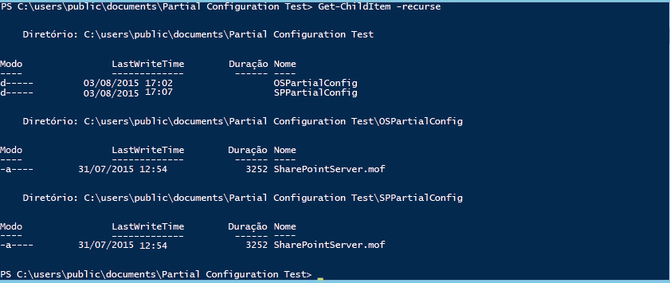

# Configurações parciais da Configuração de Estado Desejado do PowerShell

>Aplica-se a: Windows PowerShell 5.0

No PowerShell 5.0, a Configuração de Estado Desejado (DSC) permite que as configurações sejam entregues em fragmentos e de várias fontes. O Gerenciador de Configurações Local (LCM) no nó de destino reúne os fragmentos antes de aplicá-los como uma única configuração. Essa capacidade permite compartilhar o controle de configuração entre equipes ou pessoas. Por exemplo, se duas ou mais equipes de desenvolvedores estiverem colaborando em um serviço, cada uma poderá querer criar configurações para gerenciar sua parte do serviço. Cada uma dessas configurações pode ser extraída de servidores de pull diferentes e adicionada em diferentes estágios do desenvolvimento. Configurações parciais também permitem que diferentes pessoas ou equipes controlem diferentes aspectos da configuração de nós sem a necessidade de coordenar a edição de um documento único de configuração. Por exemplo, uma equipe pode ser responsável por implantar uma VM e o sistema operacional, enquanto outra equipe pode implantar outros aplicativos e serviços em tal VM. Com configurações parciais, cada equipe pode criar sua própria configuração, sem complicações desnecessárias.

É possível usar configurações parciais no modo de push, no modo de pull ou em uma combinação de ambos.

## Configurações parciais no modo de push
Para usar configurações parciais no modo de push, o LCM é configurado no nó de destino para receber as configurações parciais. Cada configuração parcial deve ser enviada por push para o destino usando o cmdlet Publish-DSCConfiguration. Em seguida, o nó de destino combina a configuração parcial em uma única configuração; pode-se aplicar a configuração chamando o cmdlet [Start-DscConfiguration](https://technet.microsoft.com/en-us/library/dn521623.aspx).

### Configurando o LCM para configurações parciais no modo de push
Para configurar o LCM para configurações parciais no modo de push, é criada uma configuração **DSCLocalConfigurationManager** com um bloco **PartialConfiguration** para cada configuração parcial. Para obter mais informações sobre como configurar o LCM, consulte [Configurando o Gerenciador de Configurações Local com o Windows](https://technet.microsoft.com/en-us/library/mt421188.aspx). O exemplo a seguir mostra uma configuração do LCM que espera duas configurações parciais—uma que implanta o sistema operacional e outra que implanta e configura o SharePoint.

```powershell
[DSCLocalConfigurationManager()]
configuration PartialConfigDemo
{
    Node localhost
    {
        
           PartialConfiguration OSInstall
        {
            Description = 'Configuration for the Base OS'
            RefreshMode = 'Push'
        }
           PartialConfiguration SharePointConfig
        {
            Description = 'Configuration for the SharePoint server'
            RefreshMode = 'Push'
        }
    }
}
PartialConfigDemo 
```

O **RefreshMode** para cada configuração parcial é definido como "Push". Os nomes dos blocos **PartialConfiguration** (nesse caso, "OSInstall" e "SharePointConfig") devem corresponder exatamente aos nomes das configurações que são enviados por push para o nó de destino.

### Publicando e iniciando configurações parciais no modo de push


A seguir, chame **Publish-DSCConfiguration** para cada configuração, passando as pastas que contêm os documentos de configuração como os parâmetros Path. Depois de publicar as duas configurações, é possível chamar `Start-DSCConfiguration –UseExisting` no nó de destino.

## Configurações parciais no modo de pull

Configurações parciais podem ser extraídas por push de um ou mais servidores de pull (para obter mais informações sobre servidores de pull, consulte [Servidores de Pull de Configuração de Estado Desejado do Windows PowerShell](pullServer.md). Para fazer isso, você precisa configurar o LCM no nó de destino a fim de extrair por push as configurações parciais, bem como nomear e localizar os documentos de configuração corretamente nos servidores de pull.

### Configurando o LCM para configurações no nó de pull

Para configurar o LCM para efetuar o pull de configurações parciais de um servidor de pull, defina o servidor de pull em um bloco **ConfigurationRepositoryWeb** (para um servidor de pull de HTTP) ou **ConfigurationRepositoryShare** (para um servidor de pull de SMB). Em seguida, crie blocos **PartialConfiguration** que se refiram ao servidor de pull, usando a propriedade **ConfigurationSource**. Também é necessário criar um bloco **Settings** para especificar que o LCM usa o modo de pull, além de especificar o **ConfigurationNames** ou o **ConfigurationID** que o servidor de pull e o nó de destino usam para identificar as configurações. A metaconfiguração a seguir define um servidor de pull de HTTP denominado CONTOSO-PullSrv e duas configurações parciais que usam um servidor de pull.

Para obter mais informações sobre como configurar um LCM usando **ConfigurationNames**, consulte [Configurando um cliente de pull usando nomes de configuração](pullClientConfigNames.md). Para obter mais informações sobre como configurar um LCM usando **ConfigurationID**, consulte [Configurando um cliente de pull usando a ID de configuração](pullClientConfigID.md).

#### Configurando o LCM para configurações de modo de pull usando os nomes de configuração

```powershell
[DscLocalConfigurationManager()]
Configuration PartialConfigDemoConfigNames
{
        Settings
        {
            RefreshFrequencyMins            = 30;
            RefreshMode                     = "PULL";
            ConfigurationMode               ="ApplyAndAutocorrect";
            AllowModuleOverwrite            = $true;
            RebootNodeIfNeeded              = $true;
            ConfigurationModeFrequencyMins  = 60;
        }
        ConfigurationRepositoryWeb CONTOSO-PullSrv
        {
            ServerURL                       = 'https://CONTOSO-PullSrv:8080/PSDSCPullServer.svc'    
            RegistrationKey                 = 5b41f4e6-5e6d-45f5-8102-f2227468ef38     
            ConfigurationNames              = @("OSInstall", "SharePointConfig")
        }     
        
        PartialConfiguration Part1 
        {
            Description                     = "OSInstall"
            ConfigurationSource             = @("[ConfigurationRepositoryWeb]CONTOSO-PullSrv") 
        }
 
        PartialConfiguration SharePointConfig
        {
            Description                     = "SharePointConfig"
            ConfigurationSource             = @("[ConfigurationRepositoryWeb]CONTOSO-PullSrv")
            DependsOn                       = '[PartialConfiguration]OSInstall'
        }
   
}
``` 

#### Configurando o LCM para configurações de modo de pull usando ConfigurationID

```powershell
[DSCLocalConfigurationManager()]
configuration PartialConfigDemoConfigID
{
    Node localhost
    {
        Settings
        {
            RefreshMode                     = 'Pull'
            ConfigurationID                 = '1d545e3b-60c3-47a0-bf65-5afc05182fd0'
            RefreshFrequencyMins            = 30 
            RebootNodeIfNeeded              = $true
        }
        ConfigurationRepositoryWeb CONTOSO-PullSrv
        {
            ServerURL                       = 'https://CONTOSO-PullSrv:8080/PSDSCPullServer.svc'
            
        }
        
           PartialConfiguration OSInstall
        {
            Description                     = 'Configuration for the Base OS'
            ConfigurationSource             = '[ConfigurationRepositoryWeb]CONTOSO-PullSrv'
            RefreshMode                     = 'Pull'
        }
           PartialConfiguration SharePointConfig
        {
            Description                     = 'Configuration for the Sharepoint Server'
            ConfigurationSource             = '[ConfigurationRepositoryWeb]CONTOSO-PullSrv'
            DependsOn                       = '[PartialConfiguration]OSInstall'
            RefreshMode                     = 'Pull'
        }
    }
}
PartialConfigDemo 
```

Você pode extrair configurações parciais de mais de um servidor de pull—precisaria apenas definir cada servidor de pull e referir-se ao servidor de pull apropriado em cada bloco PartialConfiguration.

Depois de criar a metaconfiguração, deve executá-la para criar um documento de configuração (um arquivo MOF) e, em seguida, chamar [Set-DscLocalConfigurationManager](https://technet.microsoft.com/en-us/library/dn521621(v=wps.630).aspx) para configurar o LCM.

### Nomeando e colocando os documentos de configuração no servidor de pull (ConfigurationNames)

Os documentos de configuração parcial devem ser colocados na pasta especificada como o **ConfigurationPath** no arquivo `web.config` para o servidor de pull (geralmente `C:\Program Files\WindowsPowerShell\DscService\Configuration`). Os documentos de configuração devem ser nomeados da seguinte maneira: `ConfigurationName.mof`, em que _ConfigurationName_ é o nome da configuração parcial. Para nosso exemplo, os documentos de configuração devem ser nomeados da seguinte maneira:

```
OSInstall.mof
OSInstall.mof.checksum
SharePointConfig.mof
SharePointConfig.mof.checksum
```

### Nomeando e colocando os documentos de configuração no servidor de pull (ConfigurationID)

Os documentos de configuração parcial devem ser colocados na pasta especificada como o **ConfigurationPath** no arquivo `web.config` para o servidor de pull (geralmente `C:\Program Files\WindowsPowerShell\DscService\Configuration`). Os documentos de configuração devem ser nomeados da seguinte maneira: _ConfigurationName_. _ConfigurationID_`.mof`, em que _ConfigurationName_ é o nome da configuração parcial e _ConfigurationID_ é a ID de configuração definida no LCM no nó de destino. Para nosso exemplo, os documentos de configuração devem ser nomeados da seguinte maneira:

```
OSInstall.1d545e3b-60c3-47a0-bf65-5afc05182fd0.mof
OSInstall.1d545e3b-60c3-47a0-bf65-5afc05182fd0.mof.checksum
SharePointConfig.1d545e3b-60c3-47a0-bf65-5afc05182fd0.mof
SharePointConfig.1d545e3b-60c3-47a0-bf65-5afc05182fd0.mof.checksum
```


### Executando configurações parciais de um servidor de pull

Depois que o LCM no nó de destino tiver sido configurado e os documentos de configuração tiverem sido criados e chamados corretamente no servidor de pull, o nó de destino vai efetuar o pull das configurações parciais, combiná-las e aplicar a configuração resultante em intervalos regulares, conforme especificado pela propriedade **RefreshFrequencyMins** do LCM. Se você quiser forçar uma atualização, poderá chamar o cmdlet [Update-DscConfiguration](https://technet.microsoft.com/en-us/library/mt143541.aspx) para efetuar o pull das configurações e, em seguida, `Start-DSCConfiguration –UseExisting` para aplicá-las.


## Configurações parciais nos modos de push e pull combinados

Também é possível combinar os modos de push e pull para configurações parciais. Ou seja, você pode ter uma configuração parcial que é extraída por pull de um servidor de pull, enquanto outra configuração parcial é enviada por push. Trate cada configuração parcial como quiser, dependendo do modo de atualização, conforme descrito nas seções anteriores. Por exemplo, a metaconfiguração a seguir descreve o mesmo exemplo, com a configuração parcial do sistema operacional no modo de pull e a configuração parcial do SharePoint no modo de push.

### Modos de pull e push mistos usando ConfigurationNames

```powershell
[DscLocalConfigurationManager()]
Configuration PartialConfigDemoConfigNames
{
        Settings
        {
            RefreshFrequencyMins            = 30;
            RefreshMode                     = "PULL";
            ConfigurationMode               = "ApplyAndAutocorrect";
            AllowModuleOverwrite            = $true;
            RebootNodeIfNeeded              = $true;
            ConfigurationModeFrequencyMins  = 60;
        }
        ConfigurationRepositoryWeb CONTOSO-PullSrv
        {
            ServerURL                       = 'https://CONTOSO-PullSrv:8080/PSDSCPullServer.svc'    
            RegistrationKey                 = 5b41f4e6-5e6d-45f5-8102-f2227468ef38     
            ConfigurationNames              = @("OSInstall", "SharePointConfig")
        }     
        
        PartialConfiguration OSInstall 
        {
            Description                     = "OSInstall"
            ConfigurationSource             = @("[ConfigurationRepositoryWeb]CONTOSO-PullSrv")
            RefreshMode                     = 'Pull' 
        }
 
        PartialConfiguration SharePointConfig
        {
            Description                     = "SharePointConfig"
            DependsOn                       = '[PartialConfiguration]OSInstall'
            RefreshMode                     = 'Push'
        }
   
}
``` 

### Modos de pull e push mistos usando ConfigurationID

```powershell
[DSCLocalConfigurationManager()]
configuration PartialConfigDemo
{
    Node localhost
    {
        Settings
        {
            RefreshMode             = 'Pull'
            ConfigurationID         = '1d545e3b-60c3-47a0-bf65-5afc05182fd0'
            RefreshFrequencyMins    = 30 
            RebootNodeIfNeeded      = $true
        }
        ConfigurationRepositoryWeb CONTOSO-PullSrv
        {
            ServerURL               = 'https://CONTOSO-PullSrv:8080/PSDSCPullServer.svc'
            
        }
        
           PartialConfiguration OSInstall
        {
            Description             = 'Configuration for the Base OS'
            ConfigurationSource     = '[ConfigurationRepositoryWeb]CONTOSO-PullSrv'
            RefreshMode             = 'Pull'
        }
           PartialConfiguration SharePointConfig
        {
            Description             = 'Configuration for the Sharepoint Server'
            DependsOn               = '[PartialConfiguration]OSInstall'
            RefreshMode             = 'Push'
        }
    }
}
PartialConfigDemo 
```

Observe que o **RefreshMode** especificado no bloco Settings é "Pull", mas o **RefreshMode** para a configuração parcial OSInstall é "Push".

É necessário nomear e localizar os documentos do MOF de configuração, conforme descrito acima, para os respectivos modos de atualização. Chame o **Publish-DSCConfiguration** para publicar a configuração parcial do `SharePointInstall` e aguardar até a configuração do `OSInstall` ser extraída por pull do servidor de pull ou forçar uma atualização chamando [Update-DscConfiguration](https://technet.microsoft.com/en-us/library/mt143541(v=wps.630).aspx).

## Exemplo de configuração parcial do OSInstall 

```powershell
Configuration OSInstall
{
    Param (
        [Parameter(Mandatory,
                   HelpMessage="Domain credentials required to add domain\sharepoint_svc to the local Administrators group.")]
        [ValidateNotNullOrEmpty()]
        [pscredential]$Credential
    )

    Import-DscResource -ModuleName PSDesiredStateConfiguration


    Node localhost
    {
        Group LocalAdmins
        {
            GroupName           = 'Administrators'
            MembersToInclude    = 'domain\sharepoint_svc',
                                  'admins@example.domain'
            Ensure              = 'Present'
            Credential          = $Credential
            
        }

        WindowsFeature Telnet
        {
            Name                = 'Telnet-Server'
            Ensure              = 'Absent'
        }
    }
}
OSInstall

```
## Exemplo de configuração parcial do SharePointConfig
```powershell
Configuration SharePointConfig
{
    Param (
        [Parameter(Mandatory)]
        [ValidateNotNullOrEmpty()]
        [pscredential]$ProductKey
    )

    Import-DscResource -ModuleName xSharePoint

    Node localhost
    {
        xSPInstall SharePointDefault
        {
            Ensure      = 'Present'
            BinaryDir   = '\\FileServer\Installers\Sharepoint\'
            ProductKey  = $ProductKey
        }
    }
}
SharePointConfig
```
##Consulte Também 

**Conceitos**
[Servidores de pull da Configuração do Estado Desejado do Windows PowerShell](pullServer.md) 
[Configurando o Gerenciador de Configurações local](https://technet.microsoft.com/en-us/library/mt421188.aspx) 


<!--HONumber=Jun16_HO4-->


