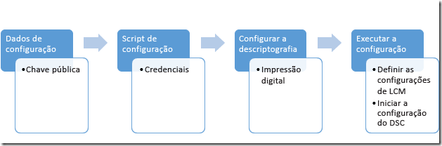

# Protegendo o Arquivo MOF

>Aplica-se a: Windows PowerShell 4.0, Windows PowerShell 5.0

Para informar aos nós de destino qual configuração deveriam ter, a DSC envia um arquivo MOF com essas informações para cada nó, em que o Gerenciador de Configurações Local (LCM) implementa a configuração desejada. Como esse arquivo contém os detalhes da configuração, é importante mantê-lo em segurança. Para fazer isso, você pode definir o LCM para verificar as credenciais de um usuário. Este tópico descreve como transmitir essas credenciais com segurança para o nó de destino criptografando-as com certificados.

>**Observação:** este tópico discute os certificados usados para criptografia. Para criptografia, um certificado autoassinado é suficiente porque a chave privada é mantida sempre segredo e a criptografia não afeta a confiança do documento. Certificados autoassinados *não* devem ser usados para fins de autenticação. Você deve usar um certificado de uma AC (Autoridade de Certificação) confiável para fins de autenticação.

## Pré-requisitos

Para criptografar com êxito as credenciais usadas para proteger uma configuração DSC, verifique se que você tem o seguinte:

* **Algum meio de emitir e distribuir certificados**. Este tópico e seus exemplos pressupõem que você está usando uma Autoridade de Certificação do Active Directory. Para obter mais informações sobre os Serviços de Certificados do Active Directory, consulte [Visão Geral dos Serviços de Certificados do Active Directory](https://technet.microsoft.com/library/hh831740.aspx) e [Serviços de Certificados do Active Directory no Windows Server 2008](https://technet.microsoft.com/windowsserver/dd448615.aspx).
* **Acesso administrativo ao nó ou nós de destino**.
* **Cada nó de destino tem um certificado com capacidade de criptografia salvo no seu Repositório Pessoal**. No Windows PowerShell, o caminho até o repositório é Cert:\LocalMachine\My. Os exemplos neste tópico usam o modelo “autenticação de estação de trabalho”, que você pode encontrar (junto com outros modelos de certificado) em [Modelos de Certificados Padrão](https://technet.microsoft.com/library/cc740061(v=WS.10).aspx).
* Se você for executar essa configuração em um computador diferente do nó de destino, **exporte a chave pública do certificado** e, em seguida, importe-a para o computador no qual executará a configuração. Certifique-se de exportar apenas a chave **pública**; mantenha a chave privada em segurança.

## Processo geral

 1. Configure os certificados, chaves e as impressões digitais, certificando-se de que cada nó de destino possua cópias do certificado e que o computador de configuração tenha a chave pública e a impressão digital.
 2. Crie um bloco de dados de configuração que contenha o caminho e a impressão digital da chave pública.
 3. Crie um script de configuração que defina a configuração desejada para o nó de destino e configure a descriptografia em nós de destino ao ordenar que o Gerenciador de Configurações Local descriptografe os dados de configuração usando o certificado e sua impressão digital.
 4. Execute a configuração, que definirá as configurações do Gerenciador de Configurações Local e iniciará a configuração DSC.



## Requisitos de Certificado

Para ativar a criptografia de credenciais, um certificado de chave pública deve estar disponível no _Nó de Destino_ que é **confiável** para o computador que está sendo usado para criar a configuração DSC.
Esse certificado de chave pública tem requisitos específicos para ser usado para criptografia de credencial DSC:
 1. **Uso de chave**:
   - Deve conter: 'KeyEncipherment' e 'DataEncipherment'.
   - _Não_ deve conter: “Assinatura Digital”.
 2. **Uso avançado de chave**:
   - Deve conter: Criptografia de Documento (1.3.6.1.4.1.311.80.1).
   - _Não_ deve conter: Autenticação de Cliente (1.3.6.1.5.5.7.3.2) e Autenticação de Servidor (1.3.6.1.5.5.7.3.1).
 3. A Chave Privada do certificado está disponível no *Nó de Destino_.
 4. O **Provedor** para o certificado deve ser "Microsoft RSA SChannel Cryptographic Provider".
 
>**Melhor Prática Recomendada:** embora você possa usar um certificado contendo um Uso de Chave de 'Assinatura Digital' ou um dos EKUs de autenticação, isso permitirá que a chave de criptografia seja mais facilmente usada de modo incorreto e fique mais vulnerável a ataques. Assim, a melhor prática é usar um certificado criado especificamente para a finalidade de proteger credenciais DSC que omite esses Usos de Chave e EKUs.
  
Qualquer certificado existente no _Nó de Destino_ que atende esses critérios pode ser usado para proteger credenciais DSC.

## Criação de certificado

Há duas abordagens que você pode executar para criar e usar o certificado de criptografia necessário (par de chaves públicas-privadas).

1. Criá-lo no **Nó de Destino** e exportar apenas a chave pública para o **Nó de Criação**
2. Criá-lo no **Nó de Criação** e exportar o par de chaves inteiro para o **Nó de Destino**

O Método 1 é recomendado porque a chave privada usada para descriptografar credenciais no MOF permanece no nó de destino em todos os momentos.


### Criando o certificado no nó de destino

A chave privada deve ser mantida em segredo, pois é usada para descriptografar o MOF no **Nó de Destino**. A forma mais fácil de fazer isso é criar o certificado da chave privada no **Nó de Destino** e copiar o **certificado de chave pública** no computador que está sendo usado para criar a configuração DSC em um arquivo MOF.
O exemplo a seguir:
 1. cria um certificado no **Nó de destino**
 2. exporta o certificado de chave pública para o **Nó de destino**.
 3. importa o certificado de chave pública para o **meu** repositório de certificados no **Nó de criação**.

#### No Nó de destino: criar e exportar o certificado
>Nó de Criação: Windows Server 2016 e Windows 10

```powershell
# note: These steps need to be performed in an Administrator PowerShell session
$cert = New-SelfSignedCertificate -Type DocumentEncryptionCertLegacyCsp -DnsName 'DscEncryptionCert' -HashAlgorithm SHA256
# export the public key certificate
$cert | Export-Certificate -FilePath "$env:temp\DscPublicKey.cer" -Force
```
Uma vez exportado, o ```DscPublicKey.cer``` precisaria ser copiados no **Nó de Criação**.

>Nó de Criação: Windows Server 2012 R2/Windows 8.1 e versões anteriores

Como não há suporte para o cmdlet New-SelfSignedCertificate em sistemas operacionais Windows anteriores ao Windows 10 e o Windows Server 2016 não dá suporte ao parâmetro **Type**, um método alternativo de criar esse certificado é necessário nesses sistemas operacionais.
Nesse caso, você pode usar ```makecert.exe``` ou ```certutil.exe``` para criar o certificado.

Um método alternativo é [baixar o script New-SelfSignedCertificateEx.ps1 do Microsoft Script Center](https://gallery.technet.microsoft.com/scriptcenter/Self-signed-certificate-5920a7c6) e usá-lo para criar o certificado em vez disso:
```powershell
# note: These steps need to be performed in an Administrator PowerShell session
# and in the folder that contains New-SelfSignedCertificateEx.ps1
. .\New-SelfSignedCertificateEx.ps1
New-SelfsignedCertificateEx `
    -Subject "CN=${ENV:ComputerName}" `
    -EKU 'Document Encryption' `
    -KeyUsage 'KeyEncipherment, DataEncipherment' `
    -SAN ${ENV:ComputerName} `
    -FriendlyName 'DSC Credential Encryption certificate' `
    -Exportable `
    -StoreLocation 'LocalMachine' `
    -StoreName 'My' `
    -KeyLength 2048 `
    -ProviderName 'Microsoft Enhanced Cryptographic Provider v1.0' `
    -AlgorithmName 'RSA' `
    -SignatureAlgorithm 'SHA256'
# Locate the newly created certificate
$Cert = Get-ChildItem -Path cert:\LocalMachine\My `
    | Where-Object {
        ($_.FriendlyName -eq 'DSC Credential Encryption certificate') `
        -and ($_.Subject -eq "CN=${ENV:ComputerName}")
    } | Select-Object -First 1
# export the public key certificate
$cert | Export-Certificate -FilePath "$env:temp\DscPublicKey.cer" -Force
```
Uma vez exportado, o ```DscPublicKey.cer``` precisaria ser copiados no **Nó de Criação**.

#### No Nó de Criação: importar a chave pública do certificado
```powershell
# Import to the my store
Import-Certificate -FilePath "$env:temp\DscPublicKey.cer" -CertStoreLocation Cert:\LocalMachine\My
```

### Criando o certificado no Nó de Criação
Como alternativa, o certificado de criptografia pode ser criado no **Nó de Criação**, exportado com a **chave privada** como um arquivo PFX e, em seguida, importado no **Nó de Destino**.
Esse é o método atual para implementar a criptografia de credencial DSC no _Nano Server_.
Embora o PFX seja protegido por uma senha, ele deve ser mantido seguro durante o trânsito.
O exemplo a seguir:
 1. cria um certificado no **Nó de criação**.
 2. exporta o certificado, incluindo a chave privada do **Nó de criação**.
 3. remove a chave privada do **Nó de criação**, mas mantém o certificado de chave pública no **meu** repositório.
 4. importa o certificado de chave privada para o repositório de certificados raiz no **Nó de destino**.
   - ele deve ser adicionado ao repositório raiz para que seja confiável pelo **Nó de destino**.

#### No Nó de criação: criar e exportar o certificado
>Nó de destino: Windows Server 2016 e Windows 10

```powershell
# note: These steps need to be performed in an Administrator PowerShell session
$cert = New-SelfSignedCertificate -Type DocumentEncryptionCertLegacyCsp -DnsName 'DscEncryptionCert' -HashAlgorithm SHA256
# export the private key certificate
$mypwd = ConvertTo-SecureString -String "YOUR_PFX_PASSWD" -Force -AsPlainText
$cert | Export-PfxCertificate -FilePath "$env:temp\DscPrivateKey.pfx" -Password $mypwd -Force
# remove the private key certificate from the node but keep the public key certificate
$cert | Export-Certificate -FilePath "$env:temp\DscPublicKey.cer" -Force
$cert | Remove-Item -Force
Import-Certificate -FilePath "$env:temp\DscPublicKey.cer" -CertStoreLocation Cert:\LocalMachine\My
```
Uma vez exportado, o ```DscPrivateKey.cer``` precisaria ser copiado no **Nó de Destino**.

>Nó de destino: Windows Server 2012 R2/Windows 8.1 e versões anteriores

Como não há suporte para o cmdlet New-SelfSignedCertificate em sistemas operacionais Windows anteriores ao Windows 10 e o Windows Server 2016 não dá suporte ao parâmetro **Type**, um método alternativo de criar esse certificado é necessário nesses sistemas operacionais.
Nesse caso, você pode usar ```makecert.exe``` ou ```certutil.exe``` para criar o certificado.

Um método alternativo é [baixar o script New-SelfSignedCertificateEx.ps1 do Microsoft Script Center](https://gallery.technet.microsoft.com/scriptcenter/Self-signed-certificate-5920a7c6) e usá-lo para criar o certificado em vez disso:
```powershell
# note: These steps need to be performed in an Administrator PowerShell session
# and in the folder that contains New-SelfSignedCertificateEx.ps1
. .\New-SelfSignedCertificateEx.ps1
New-SelfsignedCertificateEx `
    -Subject "CN=${ENV:ComputerName}" `
    -EKU 'Document Encryption' `
    -KeyUsage 'KeyEncipherment, DataEncipherment' `
    -SAN ${ENV:ComputerName} `
    -FriendlyName 'DSC Credential Encryption certificate' `
    -Exportable `
    -StoreLocation 'LocalMachine' `
    -StoreName 'My' `
    -KeyLength 2048 `
    -ProviderName 'Microsoft Enhanced Cryptographic Provider v1.0' `
    -AlgorithmName 'RSA' `
    -SignatureAlgorithm 'SHA256'
# Locate the newly created certificate
$Cert = Get-ChildItem -Path cert:\LocalMachine\My `
    | Where-Object {
        ($_.FriendlyName -eq 'DSC Credential Encryption certificate') `
        -and ($_.Subject -eq "CN=${ENV:ComputerName}")
    } | Select-Object -First 1
# export the public key certificate
$mypwd = ConvertTo-SecureString -String "YOUR_PFX_PASSWD" -Force -AsPlainText
$cert | Export-PfxCertificate -FilePath "$env:temp\DscPrivateKey.pfx" -Password $mypwd -Force
# remove the private key certificate from the node but keep the public key certificate
$cert | Export-Certificate -FilePath "$env:temp\DscPublicKey.cer" -Force
$cert | Remove-Item -Force
Import-Certificate -FilePath "$env:temp\DscPublicKey.cer" -CertStoreLocation Cert:\LocalMachine\My
```

#### No Nó de destino: importar a chave privada do certificado como uma raiz confiável
```powershell
# Import to the root store so that it is trusted
$mypwd = ConvertTo-SecureString -String "YOUR_PFX_PASSWD" -Force -AsPlainText
Import-PfxCertificate -FilePath "$env:temp\DscPrivateKey.pfx" -CertStoreLocation Cert:\LocalMachine\Root -Password $mypwd > $null
```

## Dados de configuração

O bloco de dados de configuração define em quais nós de destino vai operar, se vai criptografar as credenciais ou não, o meio de criptografia e outras informações. Para obter mais informações sobre o bloco de dados de configuração, consulte [Separando Dados de Configuração e de Ambiente](configData.md).

Os elementos que podem ser configurados para cada nó que estão relacionados à criptografia de credencial são:
* **NodeName**: o nome do nó de destino para o qual a criptografia de credencial está sendo configurada.
* **PsDscAllowPlainTextPassword**: se credenciais sem criptografia poderão ou não ser passadas para esse nó. Isso **não é recomendável**.
* **Impressão digital**: a impressão digital do certificado que será usada para descriptografar as credenciais na Configuração DSC no _Nó de Destino_. **Esse certificado deve existir no repositório de certificados do Computador Local no Nó de Destino.**
* **CertificateFile**: o arquivo de certificado (contendo somente a chave pública) que deve ser usado para criptografar as credenciais para o _Nó de Destino_. Isso deve ser X.509 binário codificado por DER ou um arquivo de certificado de formato X.509 com codificação de Base 64.

Este exemplo mostra um bloco de dados de configuração que especifica um nó de destino para atuar no targetNode nomeado, o caminho até o arquivo de certificado de chave pública (denominado targetNode.cer) e a impressão digital da chave pública.

```powershell
$ConfigData= @{ 
    AllNodes = @(     
            @{  
                # The name of the node we are describing 
                NodeName = "targetNode" 

                # The path to the .cer file containing the 
                # public key of the Encryption Certificate 
                # used to encrypt credentials for this node 
                CertificateFile = "C:\publicKeys\targetNode.cer" 

         
                # The thumbprint of the Encryption Certificate 
                # used to decrypt the credentials on target node 
                Thumbprint = "AC23EA3A9E291A75757A556D0B71CBBF8C4F6FD8" 
            }; 
        );    
    }
```


## Script de configuração

No próprio script de configuração, use o parâmetro `PsCredential` para garantir que as credenciais sejam armazenadas pelo menor tempo possível. Quando você executa o exemplo fornecido, a DSC solicitará credenciais e, em seguida, criptografará o arquivo MOF usando o CertificateFile que está associado com o nó de destino no bloco de dados de configuração. Este exemplo de código copia um arquivo de um compartilhamento protegido para um usuário.

```
configuration CredentialEncryptionExample 
{ 
    param( 
        [Parameter(Mandatory=$true)] 
        [ValidateNotNullorEmpty()] 
        [PsCredential] $credential 
        ) 
    

    Node $AllNodes.NodeName 
    { 
        File exampleFile 
        { 
            SourcePath = "\\Server\share\path\file.ext" 
            DestinationPath = "C:\destinationPath" 
            Credential = $credential 
        } 
    } 
}
```

## Configurando a descriptografia

Para que o [`Start-DscConfiguration`](https://technet.microsoft.com/en-us/library/dn521623.aspx) possa funcionar, você precisa informar ao Gerenciador de Configurações Local em cada nó de destino qual certificado usar para descriptografar as credenciais, usando o recurso CertificateID para verificar a impressão digital do certificado. A função neste exemplo encontrará o certificado local apropriado (talvez seja necessário personalizá-lo para ele encontrar o certificado exato que você deseja usar):

```powershell
# Get the certificate that works for encryption 
function Get-LocalEncryptionCertificateThumbprint 
{ 
    (dir Cert:\LocalMachine\my) | %{
        # Verify the certificate is for Encryption and valid 
        if ($_.PrivateKey.KeyExchangeAlgorithm -and $_.Verify()) 
        { 
            return $_.Thumbprint 
        } 
    } 
}
```

Com o certificado identificado por sua impressão digital, o script de configuração pode ser atualizado para usar o valor:

```powershell
configuration CredentialEncryptionExample 
{ 
    param( 
        [Parameter(Mandatory=$true)] 
        [ValidateNotNullorEmpty()] 
        [PsCredential] $credential 
        ) 
    

    Node $AllNodes.NodeName 
    { 
        File exampleFile 
        { 
            SourcePath = "\\Server\share\path\file.ext" 
            DestinationPath = "C:\destinationPath" 
            Credential = $credential 
        } 
        
        LocalConfigurationManager 
        { 
             CertificateId = $node.Thumbprint 
        } 
    } 
}
```

## Executando a configuração

Neste ponto, você pode executar a configuração, o que resultará em dois arquivos:

 * Um arquivo *.meta.mof que configura o Gerenciador de Configurações Local para descriptografar as credenciais usando o certificado armazenado no repositório do computador local e identificado por sua impressão digital. [`Set-DscLocalConfigurationManager`](https://technet.microsoft.com/en-us/library/dn521621.aspx) aplica-se ao arquivo *.meta.mof.
 * Um arquivo MOF que realmente aplica a configuração. O Start-DscConfiguration aplica a configuração.

Estes comandos realizarão estas etapas:

```powershell
Write-Host "Generate DSC Configuration..."
CredentialEncryptionExample -ConfigurationData $ConfigData -OutputPath .\CredentialEncryptionExample

Write-Host "Setting up LCM to decrypt credentials..."
Set-DscLocalConfigurationManager .\CredentialEncryptionExample -Verbose 
 
Write-Host "Starting Configuration..."
Start-DscConfiguration .\CredentialEncryptionExample -wait -Verbose
```

Este exemplo enviaria por push a configuração DSC para o nó de destino.
A configuração DSC também poderá ser aplicada usando um Servidor de Pull de DSC, se houver um disponível.

Consulte [Configurando um cliente pull de DSC](pullClient.md) para obter mais informações sobre como aplicar configurações de DSC usando um Servidor de Pull de DSC.

## Exemplo de Módulo de Criptografia de Credencial

Aqui está um exemplo completo que incorpora todas essas etapas, além de um cmdlet auxiliar que exporta e copia as chaves públicas:

```powershell
# A simple example of using credentials
configuration CredentialEncryptionExample
{
    param(
        [Parameter(Mandatory=$true)]
        [ValidateNotNullorEmpty()]
        [PsCredential] $credential
        )
    

    Node $AllNodes.NodeName
    {
        File exampleFile
        {
            SourcePath = "\\server\share\file.txt"
            DestinationPath = "C:\Users\user"
            Credential = $credential
        }
        
        LocalConfigurationManager
        {
            CertificateId = $node.Thumbprint
        }
    }
}

# A Helper to invoke the configuration, with the correct public key 
# To encrypt the configuration credentials
function Start-CredentialEncryptionExample
{
    [CmdletBinding()]
    param ($computerName)


    [string] $thumbprint = Get-EncryptionCertificate -computerName $computerName -Verbose
    Write-Verbose "using cert: $thumbprint"

    $certificatePath = join-path -Path "$env:SystemDrive\$script:publicKeyFolder" -childPath "$computername.EncryptionCertificate.cer"         

    $ConfigData=    @{
        AllNodes = @(     
                        @{  
                            # The name of the node we are describing
                            NodeName = "$computerName"

                            # The path to the .cer file containing the
                            # public key of the Encryption Certificate
                            CertificateFile = "$certificatePath"

                            # The thumbprint of the Encryption Certificate
                            # used to decrypt the credentials
                            Thumbprint = $thumbprint
                        };
                    );    
    }

    Write-Verbose "Generate DSC Configuration..."
    CredentialEncryptionExample -ConfigurationData $ConfigData -OutputPath .\CredentialEncryptionExample `
        -credential (Get-Credential -UserName "$env:USERDOMAIN\$env:USERNAME" -Message "Enter credentials for configuration") 

    Write-Verbose "Setting up LCM to decrypt credentials..."
    Set-DscLocalConfigurationManager .\CredentialEncryptionExample -Verbose 

    Write-Verbose "Starting Configuration..."
    Start-DscConfiguration .\CredentialEncryptionExample -wait -Verbose

}


#region HelperFunctions

# The folder name for the exported public keys
$script:publicKeyFolder = "publicKeys"

# Get the certificate that works for encryptions
function Get-EncryptionCertificate
{
    [CmdletBinding()]
    param ($computerName)
    $returnValue= Invoke-Command -ComputerName $computerName -ScriptBlock {
            $certificates = dir Cert:\LocalMachine\my

            $certificates | %{
                    # Verify the certificate is for Encryption and valid
                    if ($_.PrivateKey.KeyExchangeAlgorithm -and $_.Verify())
                    {
                        # Create the folder to hold the exported public key
                        $folder= Join-Path -Path $env:SystemDrive\ -ChildPath $using:publicKeyFolder
                        if (! (Test-Path $folder))
                        {
                            md $folder | Out-Null
                        }

                        # Export the public key to a well known location
                        $certPath = Export-Certificate -Cert $_ -FilePath (Join-Path -path $folder -childPath "EncryptionCertificate.cer") 

                        # Return the thumbprint, and exported certificate path
                        return @($_.Thumbprint,$certPath);
                    }
                  }
        }
    Write-Verbose "Identified and exported cert..."
    # Copy the exported certificate locally
    $destinationPath = join-path -Path "$env:SystemDrive\$script:publicKeyFolder" -childPath "$computername.EncryptionCertificate.cer"
    Copy-Item -Path (join-path -path \\$computername -childPath $returnValue[1].FullName.Replace(":","$"))  $destinationPath | Out-Null

    # Return the thumbprint
    return $returnValue[0]
}

Start-CredentialEncryptionExample
```


<!--HONumber=Jun16_HO4-->


