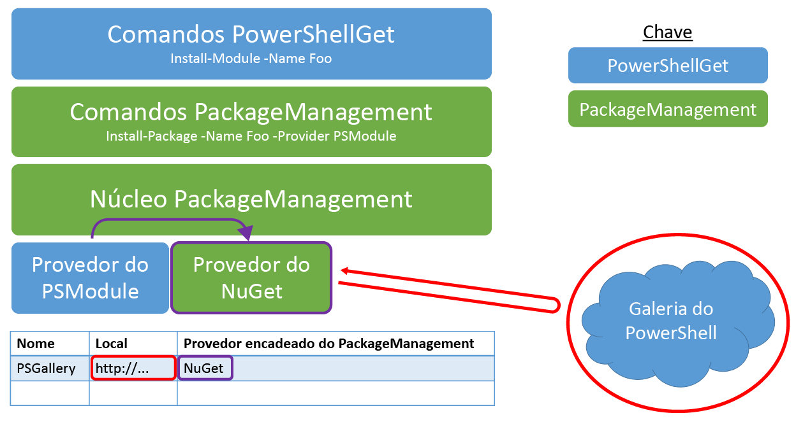

# perguntas frequentesFrequently Asked Questions

## O que é um módulo do PowerShell?What is a PowerShell module?

Um módulo do PowerShell é um pacote reutilizável que contém algumas funcionalidades do PowerShell.A PowerShell module is a reusable package containing some PowerShell functionality. Tudo no PowerShell (funções, variáveis, recursos de DSC etc.) pode ser empacotado em módulos.Everything in PowerShell (functions, variables, DSC resources, etc.) can be packaged in modules. Normalmente, os módulos são pastas que contêm tipos específicos de arquivos armazenados em um caminho específico.Typically, modules are folders containing specific types of files stored on a specific path. Há alguns tipos diferentes de módulos do PowerShell por aí.There are a few different types of PowerShell modules out there.

## O que é um script do PowerShell?What is a PowerShell script?

Um script do PowerShell é uma série de comandos que são armazenados em um arquivo .ps1 para habilitar o compartilhamento e a reutilização.A PowerShell script is a series of commands that are stored in a .ps1 file to enable reuse and sharing. Fluxos de trabalho do PowerShell também são scripts do PowerShell, que descrevem um conjunto de tarefas e fornecem o sequenciamento dessas tarefas.PowerShell workflows are also PowerShell scripts, which outline a set of tasks and provide sequencing for those tasks. Para obter mais informações, visite [Introdução ao fluxo de trabalho do PowerShell](https://technet.microsoft.com/library/jj134242.aspx).For more information, please visit [Getting Started with PowerShell Workflow](https://technet.microsoft.com/library/jj134242.aspx).

## Qual é a diferença entre os scripts e os módulos do PowerShell?How are PowerShell Scripts different from PowerShell Modules?

Normalmente, os módulos são melhores para compartilhamento, mas nós estamos habilitando o compartilhamento de scripts para facilitar que você contribua com fluxos de trabalho e scripts para a comunidade.Modules are generally better for sharing, but we are enabling script sharing to make it easier for you to contribute workflows and scripts to the community. Para obter mais informações, consulte os blogs a seguir:For more information, see the following blogs:

- [Don't Write Scripts, Write PowerShell Modules](https://blogs.technet.microsoft.com/heyscriptingguy/2011/06/27/dont-write-scripts-write-powershell-modules/) (Não escreva scripts, escreva módulos do PowerShell)[Don't Write Scripts, Write PowerShell Modules](https://blogs.technet.microsoft.com/heyscriptingguy/2011/06/27/dont-write-scripts-write-powershell-modules/)
- [Understanding PowerShell Modules](https://blogs.technet.microsoft.com/heyscriptingguy/2015/07/10/understanding-powershell-modules/) (Entendendo os módulos do PowerShell)[Understanding PowerShell Modules](https://blogs.technet.microsoft.com/heyscriptingguy/2015/07/10/understanding-powershell-modules/)

## How can I publish to the PowerShell Gallery? (Como publicar na Galeria do PowerShell?)How can I publish to the PowerShell Gallery?

Você precisa registrar uma conta na Galeria do PowerShell antes que possa publicar pacotes na Galeria.You must register an account in the PowerShell Gallery before you can publish packages to the Gallery. Isso ocorre porque a publicação de pacotes requer uma NuGetApiKey, que é fornecida no registro.This is because publishing packages requires a NuGetApiKey, which is provided upon registration. Para se registrar, use sua conta pessoal, corporativa ou de estudante para entrar na Galeria do PowerShell.To register, use your personal, work, or school account to sign in to the PowerShell Gallery. Um processo de registro único é necessário quando você entra pela primeira vez.A one-time registration process is required when you sign in for the first time. Posteriormente, a NuGetApiKey fica disponível em sua página de perfil.Afterwards, your NuGetApiKey is available on your profile page.

Após ter se registrado na Galeria, use os cmdlets [Publish-Module](https://go.microsoft.com/fwlink/?LinkID=760387&clcid=0x409) ou [Publish-Script](https://go.microsoft.com/fwlink/?LinkID=760387&clcid=0x409) para publicar seu pacote na Galeria.Once you have registered in the Gallery, use the [Publish-Module](https://go.microsoft.com/fwlink/?LinkID=760387&clcid=0x409) or [Publish-Script](https://go.microsoft.com/fwlink/?LinkID=760387&clcid=0x409) cmdlets to publish your package to the Gallery. Para obter mais detalhes sobre como executar esses cmdlets, visite a guia Publicar ou leia a documentação sobre [Publish-Module](https://go.microsoft.com/fwlink/?LinkID=760387&clcid=0x409) e [Publish-Script](https://go.microsoft.com/fwlink/?LinkID=760387&clcid=0x409).For more details on how to run these cmdlets, visit the Publish tab, or read the [Publish-Module](https://go.microsoft.com/fwlink/?LinkID=760387&clcid=0x409) and [Publish-Script](https://go.microsoft.com/fwlink/?LinkID=760387&clcid=0x409) documentation.

**Você não precisa se registrar ou entrar na Galeria para instalar ou salvar pacotes.****You do not need to register or sign in to the Gallery to install or save packages.**

## Recebi o erro "Falha ao processar solicitação.I received "Failed to process request. A chave de API especificada é inválida ou não tem permissão para acessar o pacote especificado.'The specified API key is invalid or does not have permission to access the specified package.'. O servidor remoto retornou um erro: (403) Proibido."The remote server returned an error: (403) Forbidden." erro ao tentar publicar um pacote na Galeria do PowerShell.error when I tried to publish a package to the PowerShell Gallery. O que isso significa?What does that mean?

Esse erro pode ocorrer por um dos seguintes motivos:This error can occur for the following reasons:

- **A chave de API especificada é inválida.****The specified API key is invalid.**
     Confirme se você especificou a chave de API válida de sua conta.Ensure that you have specified the valid API key from your account. Para obter sua chave de API, exiba sua página de perfil.To get your API key, view your profile page.
- **O nome do pacote especificado não pertence a você.****The specified package name is not owned by you.**
     Se você tiver confirmado que a chave de API está correta, talvez já exista um pacote com o mesmo nome do que você está tentando usar.If you have confirmed that your API key is correct, then there may already exist a package with the same name as the one you are trying to use. O pacote pode ter sido removido da lista pelo proprietário. Nesse caso, ele não será exibido nos resultados da pesquisa.The package may have been unlisted by the owner, in which case it will not appear in any search results. Para determinar se um pacote com o mesmo nome já existe, abra um navegador e navegue até a página de detalhes do pacote: `https://www.powershellgallery.com/packages/<packageName>`.To determine if a package with the same name already exists, open a browser and navigate to the package's details page: `https://www.powershellgallery.com/packages/<packageName>`. Por exemplo, navegar diretamente até `https://www.powershellgallery.com/packages/pester` levará você à página de detalhes do módulo Pester, quer ele seja removido da lista ou não.For example, navigating directly to `https://www.powershellgallery.com/packages/pester` will take you to the Pester module's details page, whether it is unlisted or not. Se um pacote com um nome conflitante já existir e não estiver listado, você poderá:If a package with a conflicting name already exists and is unlisted, you can:
    - Selecionar outro nome para o pacote.Select another name for your package.
    - Entrar em contato com os proprietários do pacote existente.Contact the owners of the existing package.

## Por que não posso entrar com minha conta pessoal, mas podia entrar ontem?Why can't I sign in with my personal account, but I could sign in yesterday?

Esteja ciente de que sua conta da Galeria não acomoda alterações no seu alias do email principal.Please be aware that your gallery account does not accommodate changes to your primary email alias. Para obter mais informações, consulte [Aliases de Email da Microsoft](https://windows.microsoft.com/windows/outlook/add-alias-account).For more information, see [Microsoft Email Aliases](https://windows.microsoft.com/windows/outlook/add-alias-account).

## Por que não vejo todos os pacotes da Galeria quando marco todas as caixas de seleção de Categoria na guia Pacotes?Why don't I see all the gallery packages when I select all the Category checkboxes on the packages tab?

Quando marca uma caixa de seleção de Categoria, você está dizendo "Eu gostaria de ver todos os pacotes desta categoria."By selecting a Category checkbox, you are stating "I would like to see all packages in this category." Somente os pacotes das categorias selecionadas serão exibidos.Only the packages in the selected categories will be displayed. De forma semelhante, quando marca todas as caixas de seleção de Categoria, você está dizendo "Eu gostaria de ver todos os pacotes de todas as categorias."So similarly, by selecting all the Category checkboxes, you are stating "I would like to see all packages in any category." Mas alguns pacotes da Galeria não pertencem a nenhuma das categorias listadas, de modo que eles não aparecerão nos resultados.But some packages in the gallery do not belong to any of the categories listed, so they will not appear in the results. Para ver todos os pacotes da Galeria, desmarque todas as Categorias ou selecione a guia Pacotes novamente.To see all packages in the gallery, uncheck all the Categories, or select the packages tab again.

## Quais são os requisitos para publicar um módulo na Galeria do PowerShell?What are the requirements to publish a module to the PowerShell Gallery?

Qualquer tipo de módulo do PowerShell (módulos de script, módulos binários ou módulos de manifesto) pode ser publicado na Galeria.Any kind of PowerShell module (script modules, binary modules, or manifest modules) can be published to the gallery. Para publicar um módulo, o PowerShellGet precisa saber algumas coisas sobre ele – a versão, a descrição, o autor e como ele está licenciado.To publish a module, PowerShellGet needs to know a few things about it - the version, description, author, and how it is licensed. Essas informações são lidas como parte do processo de publicação do *manifesto do módulo* arquivo (.psd1) ou do valor do parâmetro [**LicenseUri**](https://go.microsoft.com/fwlink/?LinkID=760387&clcid=0x409) do cmdlet **Publish-Module**.This information is read as part of the publishing process from the *module manifest* (.psd1) file, or from the value of the [**Publish-Module**](https://go.microsoft.com/fwlink/?LinkID=760387&clcid=0x409) cmdlet's **LicenseUri** parameter. Todos os módulos publicados na Galeria devem ter manifestos de módulo.All modules published to the Gallery must have module manifests. Qualquer módulo que incluir as seguintes informações em seu manifesto pode ser publicado na Galeria:Any module that includes the following information in its manifest can be published to the Gallery:

- VersãoVersion
- DescriçãoDescription
- AutorAuthor
- Um URI para os termos de licença do módulo, como parte da seção **PrivateData** do manifesto ou no parâmetro **LicenseUri** do cmdlet [**Publish-Module**](https://go.microsoft.com/fwlink/?LinkID=760387&clcid=0x409).A URI to the license terms of the module, either as part of the **PrivateData** section of the manifest, or in the **LicenseUri** parameter of the [**Publish-Module**](https://go.microsoft.com/fwlink/?LinkID=760387&clcid=0x409) cmdlet.

## Como posso criar um manifesto de módulo formatado corretamente?How do I create a correctly-formatted module manifest?

A maneira mais fácil de criar um manifesto de módulo é executar o cmdlet [**New-ModuleManifest**](https://go.microsoft.com/fwlink/?LinkID=760387&clcid=0x409).The easiest way to create a module manifest is to run the [**New-ModuleManifest**](https://go.microsoft.com/fwlink/?LinkID=760387&clcid=0x409) cmdlet. No PowerShell 5.0 ou mais recente, New-ModuleManifest gera um manifesto de módulo formatado corretamente com campos em branco para metadados úteis, como **ProjectUri**, **LicenseUri** e **Tags**.In PowerShell 5.0 or newer, New-ModuleManifest generates a correctly-formatted module manifest with blank fields for useful metadata like **ProjectUri**, **LicenseUri**, and **Tags**. Basta preencher os espaços em branco ou usar o manifesto gerado como um exemplo da formatação correta.Simply fill in the blanks, or use the generated manifest as an example of correct formatting.

Para verificar se todos os campos de metadados obrigatórios foram preenchidos corretamente, use o cmdlet [**Test-ModuleManifest**](https://go.microsoft.com/fwlink/?LinkID=760387&clcid=0x409).To verify that all required metadata fields have been properly filled, use the [**Test-ModuleManifest**](https://go.microsoft.com/fwlink/?LinkID=760387&clcid=0x409) cmdlet.

Para atualizar os campos do arquivo de manifesto do módulo, use o cmdlet [**Update-ModuleManifest**](https://go.microsoft.com/fwlink/?LinkID=760387&clcid=0x409).To update the module manifest file fields, use the [**Update-ModuleManifest**](https://go.microsoft.com/fwlink/?LinkID=760387&clcid=0x409) cmdlet.

## Quais são os requisitos para publicar um script na Galeria?What are the requirements to publish a script to the Gallery?

Qualquer tipo de script do PowerShell (scripts ou fluxos de trabalho) pode ser publicado na Galeria.Any kind of PowerShell script (scripts or workflows) can be published to the gallery. Para publicar um script, o PowerShellGet precisa saber algumas coisas sobre ele – a versão, a descrição, o autor e como ele está licenciado.To publish a script, PowerShellGet needs to know a few things about it - the version, description, author, and how it is licensed. Essas informações são lidas como parte do processo de publicação da seção *PSScriptInfo* do arquivo de script ou do valor do parâmetro [**LicenseUri**](https://go.microsoft.com/fwlink/?LinkID=760387&clcid=0x409) do cmdlet **Publish-Script**.This information is read as part of the publishing process from the script file's *PSScriptInfo* section, or from the value of the [**Publish-Script**](https://go.microsoft.com/fwlink/?LinkID=760387&clcid=0x409) cmdlet's **LicenseUri** parameter. Todos os scripts publicados na Galeria devem ter informações dos metadados.All scripts published to the Gallery must have metadata information. Qualquer script que incluir as seguintes informações em sua seção PSScriptInfo pode ser publicado na Galeria:Any script that includes the following information in its PSScriptInfo section can be published to the Gallery:

- VersãoVersion
- DescriçãoDescription
- AutorAuthor
- Um URI para os termos de licença do script, como parte da seção **PSScriptInfo** do manifesto ou no parâmetro **LicenseUri** do cmdlet [**Publish-Script**](https://go.microsoft.com/fwlink/?LinkID=760387&clcid=0x409).A URI to the license terms of the script, either as part of the **PSScriptInfo** section of the script, or in the **LicenseUri** parameter of the [**Publish-Script**](https://go.microsoft.com/fwlink/?LinkID=760387&clcid=0x409) cmdlet.

## Como pesquisar?How do I search?

Digite o que você está procurando na caixa de texto.Type what you are looking for in the text box. Por exemplo, se quiser localizar os módulos relacionados ao SQL do Azure, basta digitar "azure sql".For example, if you want to find modules that are related to Azure SQL, just type "azure sql". Nosso mecanismo de pesquisa procurará por essas palavras-chave em todos os pacotes publicados, inclusive nos títulos, descrições e metadados.Our search engine will look for those keywords in all published packages, including titles, descriptions and across metadata. Em seguida, com base em uma pontuação de qualidade ponderada, ele exibirá as correspondências mais próximas.Then, based on a weighted quality score, it will display the closest matches. Você também pode pesquisar por um campo específico usando a sintaxe campo: "valor" na consulta de pesquisa para os seguintes campos:You can also search by specific field using field:"value" syntax in the search query for the following fields:

- MarcasTags
- FunçõesFunctions
- CmdletsCmdlets
- DscResourcesDscResources
- PowerShellVersionPowerShellVersion

Portanto, por exemplo, quando você pesquisa PowerShellVersion: "2.0", apenas os resultados compatíveis com o PowerShellVersion 2.0 (com base em seu manifesto de módulo/script) serão exibidos.So, for example, when you search for PowerShellVersion:"2.0" only results that are compatible with PowerShellVersion 2.0 (based on their module/script manifest) will be displayed.

## Como posso criar um arquivo de script formatado corretamente?How do I create a correctly-formatted script file?

A maneira mais fácil de criar um arquivo de script formatado corretamente é executar o cmdlet [**New-ScriptFileInfo**](https://go.microsoft.com/fwlink/?LinkID=760387&clcid=0x409).The easiest way to create a properly-formatted script file is to run the [**New-ScriptFileInfo**](https://go.microsoft.com/fwlink/?LinkID=760387&clcid=0x409) cmdlet. No PowerShell 5.0, New-ScriptFileInfo gera um arquivo de script formatado corretamente com campos em branco para metadados úteis, como **ProjectUri**, **LicenseUri** e **Tags**.In PowerShell 5.0, New-ScriptFileInfo generates a correctly-formatted script file with blank fields for useful metadata like **ProjectUri**, **LicenseUri**, and **Tags**. Basta preencher os espaços em branco ou usar o arquivo de script gerado como um exemplo da formatação correta.Simply fill in the blanks, or use the generated script file as an example of correct formatting.

Para verificar se todos os campos de metadados obrigatórios foram preenchidos corretamente, use o cmdlet [**Test-ScriptFileInfo**](http://go.microsoft.com/fwlink/?LinkID=760387&clcid=0x409).To verify that all required metadata fields have been properly filled, use the [**Test-ScriptFileInfo**](http://go.microsoft.com/fwlink/?LinkID=760387&clcid=0x409) cmdlet.

Para atualizar os campos de metadados do script, use o cmdlet [**Update-ScriptFileInfo**](https://go.microsoft.com/fwlink/?LinkID=760387&clcid=0x409).To update the script metadata fields, use the [**Update-ScriptFileInfo**](https://go.microsoft.com/fwlink/?LinkID=760387&clcid=0x409) cmdlet.

## Quais outros tipos de módulos do PowerShell existem?What other types of PowerShell Modules exist?

O termo módulo do PowerShell também se refere aos arquivos que implementam a funcionalidade real.The term PowerShell module also refers to the files that implement actual functionality. Arquivos de módulo de script (.psm1) contêm código do PowerShell.Script module files (.psm1) contain PowerShell code. Arquivos de módulo binários (.dll) contêm código compilado.Binary module files (.dll) contain compiled code.

Esta é uma forma de pensar neles: a pasta que encapsula o módulo é a pasta de módulo.Here is one way to think about it: the folder that encapsulates the module is the module folder. A pasta de módulo pode conter um manifesto de módulo (.psd1) que descreve o conteúdo da pasta.The module folder can contain a module manifest (.psd1) that describes the contents of the folder. Os arquivos que realmente fazem o trabalho são os arquivos de módulo de script (.psm1) e os arquivos de módulo binário (.dll).The files that actually do the work are the script module files (.psm1) and the binary module files (.dll). Os recursos de DSC ficam localizados em uma subpasta específica e são implementados como arquivos de módulo de script ou de módulo binário.DSC resources are located in a specific sub-folder, and are implemented as script module files or binary module files.

Todos os módulos na Galeria contêm manifestos de módulo e a maioria desses módulos contêm arquivos de módulo de script ou módulo binário.All of the modules in the Gallery contain module manifests, and most of these modules contain script module files or binary module files. O termo módulo pode ser confuso devido a esses significados diferentes.The term module can be confusing because of these different meanings. A menos que seja indicado explicitamente o contrário, todos os usos da palavra módulo nesta página fazem referência à pasta de módulo que contém esses arquivos.Unless explicitly stated otherwise, all uses of the word module on this page refer to the module folder containing these files.

## Como PackageManagement está relacionado ao PowerShellGet?How does PackageManagement relate to PowerShellGet? (Resposta de alto nível)(High Level Answer)

PackageManagement é uma interface comum para trabalhar com qualquer gerenciador de pacotes.PackageManagement is a common interface for working with any package manager. Quer esteja lidando com módulos do PowerShell, MSIs, RubyGems, pacotes do NuGet ou módulos do Perl, você deve ser capaz de usar comandos do PackageManagement (Find-Package e Install-Package) para localizar e instalá-los.Eventually, whether you're dealing with PowerShell modules, MSIs, Ruby gems, NuGet packages, or Perl modules, you should be able to use PackageManagement's commands (Find-Package and Install-Package) to find and install them. PackageManagement faz isso tendo um provedor de pacote para cada gerenciador de pacotes que se conecta a ele.PackageManagement does this by having a package provider for each package manager that plugs into PackageManagement. Os provedores fazem todo o trabalho real; eles buscam o conteúdo de repositórios e instalam o conteúdo localmente.Providers do all of the actual work; they fetch content from repositories, and install the content locally. Frequentemente, os provedores de pacote simplesmente encapsulam as ferramentas do gerenciador de pacotes existente para um determinado tipo de pacote.Often, package providers simply wrap around the existing package manager tools for a given package type.

PowerShellGet é o gerenciador de pacotes do PowerShell.PowerShellGet is the package manager for PowerShell packages. Há um provedor de pacotes PSModule que expõe a funcionalidade do PowerShellGet por meio de PackageManagement.There is a PSModule package provider that exposes PowerShellGet functionality through PackageManagement. Por isso, é possível executar [Install-Module](https://go.microsoft.com/fwlink/?LinkID=760387&clcid=0x409) ou Install-Package -Provider PSModule para instalar um módulo na Galeria do PowerShell.Because of this, you can either run [Install-Module](https://go.microsoft.com/fwlink/?LinkID=760387&clcid=0x409) or Install-Package -Provider PSModule to install a module from the PowerShell Gallery. Algumas funcionalidades do PowerShellGet, incluindo [Update-Module](https://go.microsoft.com/fwlink/?LinkID=760387&clcid=0x409) e [Publish-Module](https://go.microsoft.com/fwlink/?LinkID=760387&clcid=0x409), não podem ser acessadas por meio de comandos do PackageManagement.Certain PowerShellGet functionality, including [Update-Module](https://go.microsoft.com/fwlink/?LinkID=760387&clcid=0x409) and [Publish-Module](https://go.microsoft.com/fwlink/?LinkID=760387&clcid=0x409), cannot be accessed through PackageManagement commands.

Em resumo, o PowerShellGet destina-se unicamente a ter uma experiência de gerenciamento de pacotes premium para o conteúdo do PowerShell.In summary, PowerShellGet is solely focused on having a premium package management experience for PowerShell content. PackageManagement destina-se a expor todas as experiências de gerenciamento de pacotes por meio de um conjunto de ferramentas geral.PackageManagement is focused on exposing all package management experiences through one general set of tools. Se você considerar esta resposta insatisfatória, haverá uma resposta longa na parte inferior deste documento, na seção **Como PackageManagement de fato está relacionado ao PowerShellGet?**.If you find this answer unsatisfying, there is a long answer at the bottom of this document, in the **How does PackageManagement actually relate to PowerShellGet?** section.

Para obter mais informações, visite a [página do projeto do PackageManagement](https://oneget.org/).For more information, please visit the [PackageManagement project page](https://oneget.org/).

## Como o NuGet está relacionado ao PowerShellGet?How does NuGet relate to PowerShellGet?

A Galeria do PowerShell é uma versão modificada da [Galeria do NuGet](https://www.nuget.org/).The PowerShell Gallery is a modified version of the [NuGet Gallery](https://www.nuget.org/). O PowerShellGet usa o provedor do NuGet para trabalhar com repositórios baseados em NuGet, como a Galeria do PowerShell.PowerShellGet uses NuGet provider to work with NuGet based repositories like the PowerShell Gallery.

Você pode usar o PowerShellGet com qualquer compartilhamento de arquivo ou repositório do NuGet válido.You can use PowerShellGet against any valid NuGet repository or file share. Basta adicionar o repositório executando o cmdlet [**Register-PSRepository**](https://go.microsoft.com/fwlink/?LinkID=760387&clcid=0x409).You simply need to add the repository by running the [**Register-PSRepository**](https://go.microsoft.com/fwlink/?LinkID=760387&clcid=0x409) cmdlet.

## Isso significa que posso usar NuGet.exe para trabalhar com a Galeria?Does that mean I can use NuGet.exe to work with the Gallery?

Sim.Yes.

## Como PackageManagement de fato está relacionado ao PowerShellGet?How does PackageManagement actually relate to PowerShellGet? (Detalhes técnicos)(Technical Details)

Nos bastidores, o PowerShellGet utiliza intensamente a infraestrutura de PackageManagement.Under the hood, PowerShellGet heavily leverages PackageManagement infrastructure.

Na camada de cmdlet do PowerShell, [Install-Module](https://go.microsoft.com/fwlink/?LinkID=760387&clcid=0x409) é, na verdade, um wrapper fino ao redor de Install-Package -Provider PSModule.At the PowerShell cmdlet layer, [Install-Module](https://go.microsoft.com/fwlink/?LinkID=760387&clcid=0x409) is actually a thin wrapper around Install-Package -Provider PSModule.

Na camada do provedor do pacote PackageManagement, o provedor de pacote PSModule chama outros provedores do pacote PackageManagement.At the PackageManagement package provider layer, the PSModule package provider actually calls into other PackageManagement package providers. Por exemplo, quando você está trabalhando com galerias baseadas em NuGet (como a Galeria do PowerShell), o provedor do pacote PSModule usa o provedor de pacote do NuGet para trabalhar com o repositório.For example, when you are working with NuGet-based galleries (such as the PowerShell Gallery), the PSModule package provider uses the NuGet Package Provider to work with the repository.

Figura 1: Arquitetura do PowerShellGetFigure 1: PowerShellGet Architecture

## O que é necessário para executar o PowerShellGet?What is required to run PowerShellGet?

De modo geral, é recomendável escolher a versão mais recente do módulo PowerShellGet (observe que ele requer o .NET 4.5).In general we recommend picking the latest version of PowerShellGet module (note that it requires .NET 4.5).

O módulo **PowerShellGet** exige o **PowerShell 3.0 ou mais recente**.The **PowerShellGet** module requires **PowerShell 3.0 or newer**.

Portanto, **PowerShellGet** exige um dos seguintes sistemas operacionais:Therefore, **PowerShellGet** requires one of the following operating systems:

- Windows 10Windows 10
- Windows 8.1 ProWindows 8.1 Pro
- Windows 8.1 EnterpriseWindows 8.1 Enterprise
- Windows 7 SP1Windows 7 SP1
- Windows Server 2016Windows Server 2016
- Windows Server 2012 R2Windows Server 2012 R2
- Windows Server 2008 R2 SP1Windows Server 2008 R2 SP1

**PowerShellGet** também exige o .NET Framework 4.5 ou posterior.**PowerShellGet** also  requires .NET Framework 4.5 or above. Você pode instalar o .NET Framework 4.5 ou acima acessando [aqui](https://msdn.microsoft.com/library/5a4x27ek.aspx).You can install .NET Framework 4.5 or above from [here](https://msdn.microsoft.com/library/5a4x27ek.aspx).

## É possível reservar nomes para pacotes que serão publicados no futuro?Is it possible to reserve names for packages that will be published in future?

Não é possível guardar nomes de pacotes.It is not possible to squat package names. Se você acreditar que um pacote existente está usando um nome que seria mais adequado para o seu pacote, tente [entrar em contato com o proprietário do pacote](./how-to/working-with-packages/contacting-package-owners.md).If you feel that an existing package has taken the name which suits your package more, try [contacting the owner of the package](./how-to/working-with-packages/contacting-package-owners.md). Se não receber uma resposta dentro de duas semanas, você poderá contatar o suporte e a equipe da Galeria do PowerShell examinará a questão.If you didnt get response within a couple of weeks, you can contact support and the PowerShell Gallery team will look in to it.

## Como declarar a propriedade de pacotes?How do I claim ownership for packages?

Confira [Gerenciando proprietários do pacote em PowerShellGallery.com](./how-to/publishing-packages/managing-package-owners.md) para obter detalhes.Check out [Managing Package Owners on PowerShellGallery.com](./how-to/publishing-packages/managing-package-owners.md) for details.

## Como lidar com um proprietário de pacote que está violando a licença do meu pacote?How do I deal with a package owner who is violating my package license?

Recomendamos que a comunidade do PowerShell trabalhe junta para resolver controvérsias que podem surgir entre os proprietários dos pacotes.We encourage the PowerShell community to work together to resolve any disputes that may arise between package owners and the owners of other packages.  Nós criamos um [processo de solução de controvérsias](./how-to/getting-support/dispute-resolution.md) e solicitamos que você o siga antes que os administradores do PowerShellGallery.com intercedam.We have crafted a [dispute resolution process](./how-to/getting-support/dispute-resolution.md) that we ask you to follow before PowerShellGallery.com administrators intercede.
