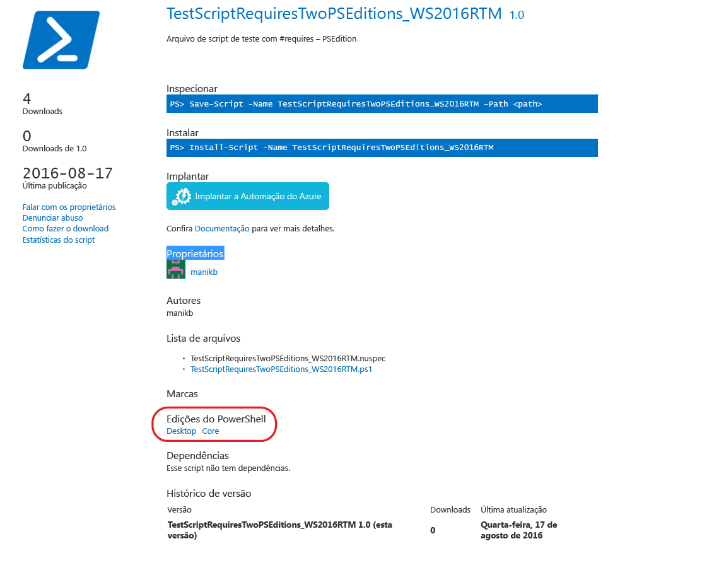
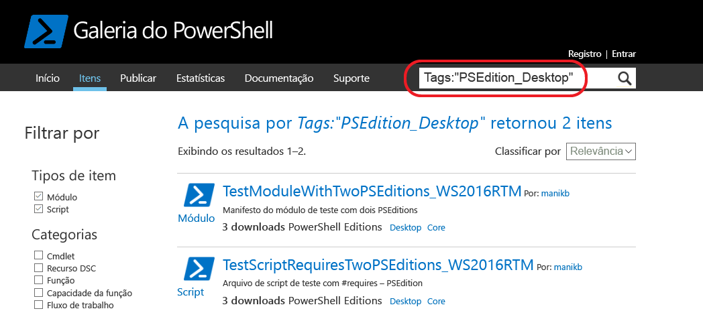

# Itens com edições compatíveis do PowerShellItems with compatible PowerShell Editions

Da versão 5.1 em diante, o PowerShell está disponível nas edições diferentes que denotam diferentes conjuntos de recursos e compatibilidade de plataforma.Starting with version 5.1, PowerShell is available in different editions which denote varying feature sets and platform compatibility.

- **Desktop Edition:** criada no .NET Framework e oferece compatibilidade com scripts e módulos destinados a versões do PowerShell em execução em edições de superfície completa do Windows, como Server Core e Área de Trabalho do Windows.**Desktop Edition:** Built on .NET Framework and provides compatibility with scripts and modules targeting versions of PowerShell running on full footprint editions of Windows such as Server Core and Windows Desktop.
- **Core Edition:** criada no .NET Core e oferece compatibilidade com scripts e módulos destinados a versões do PowerShell executando em edições de superfície reduzida do Windows, como o Nano Server e Windows IoT.**Core Edition:** Built on .NET Core and provides compatibility with scripts and modules targeting versions of PowerShell running on reduced footprint editions of Windows such as Nano Server and Windows IoT.

## A Galeria do PowerShell extrai metadados de PSEditions com suporte e permite filtrar itens compatíveis para edições específicas do PowerShellPowerShell Gallery extracts supported PSEditions metadata and allows you to filters the items compatible for specific PowerShell Editions

Se um item tiver PSEditions compatíveis especificadas, elas serão listadas como parte das "Edições do PowerShell" na página de exibição de item e nos resultados de itens.If an item has compatible PSEditions specified, they will be listed as part of 'PowerShell Editions' in the item display page and also in items results.

## Pesquise por itens na interface do usuário da Galeria que funcionem no PowerShellCoreSearch for items in the gallery UI which works on PowerShellCore

Use as marcas: "PSEdition_Desktop" e "PSEdition_Core" para filtrar os itens na Galeria do PowerShell.Use Tags:"PSEdition_Desktop" and Tags:"PSEdition_Core" to filters the items on PowerShell Gallery.

### Use as marcas: "PSEdition_Core" para pesquisar itens compatíveis com o PowerShell Core Edition.Use Tags:"PSEdition_Core" to search items compatible with PowerShell Core Edition.

### Use as marcas: "PSEdition_Desktop" para pesquisar itens compatíveis com o PowerShell Desktop Edition.Use Tags:"PSEdition_Desktop" to search items compatible with PowerShell Desktop Edition.

## Mais detalhes sobre como criar e localizar os itens com as edições compatíveis do PowerShellMore details on authoring and finding the items with compatible PowerShell Editions

- [Módulos com PSEditionsModules with PSEditions](../../concepts/module-psedition-support.md)
- [Scripts com PSEditionsScripts with PSEditions](../../concepts/script-psedition-support.md)