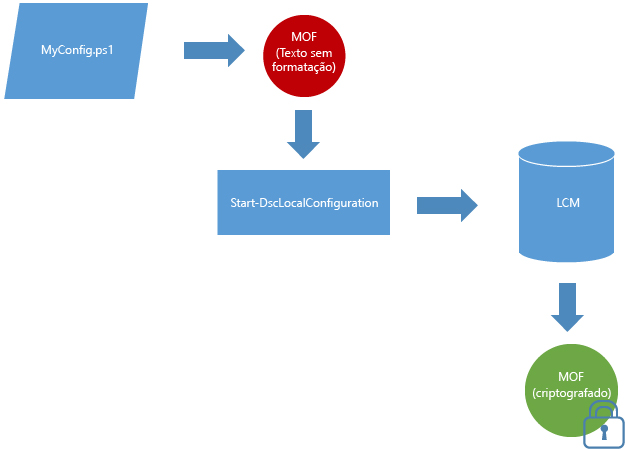

# Documentos MOF são criptografados por padrão

Documentos de configuração contêm informações confidenciais. Nas versões anteriores do DSC, era necessário distribuir e gerenciar certificados para proteger as credenciais em uma configuração. Para muitas pessoas, essa era uma carga de gerenciamento significativa e, mesmo com todo o trabalho necessário para fazer isso, ainda faltavam algumas informações de configuração que não eram e não poderiam ser protegidas. 

Isso não acontece mais, pois **todos os MOFs de configuração são protegidos por padrão**. Nenhum certificado ou definição de metaconfiguração é necessário. Sempre que um MOF de configuração é salvo em disco pelo LCM (Gerenciador de Configurações Local) em um nó de destino, ele é criptografado. Os MOFs são criptografados usando o [DPAPI](https://msdn.microsoft.com/en-us/library/ms995355.aspx). **Observação:** os MOFs gerados por um script de configuração não são criptografados.

**Exemplo:** Criptografia no modo de envio por push 

Se já estiver usando o método de certificado para criptografar senhas ou se precisar de segurança adicional para suas senhas, o [método existente de criptografia baseada em certificado](https://msdn.microsoft.com/en-us/powershell/dsc/securemof) continuará funcionando. O resultado será um documento MOF totalmente criptografado usando os DPAPIs e que, além disso, terá senhas criptografadas internas.

Essa criptografia se aplica somente a documentos MOF de configuração (pending.mof, current.mof, previous.mof e MOFs parciais). MOFs de metaconfiguração ainda são salvos em texto sem formatação, já que é menos provável que ele contenha segredos.

<!--HONumber=Jul16_HO1-->

