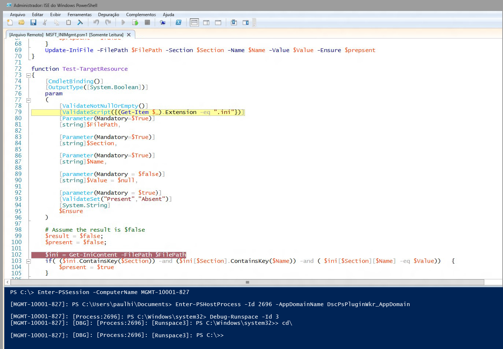

# Depuração de script do recurso DSC
A Preview de Produção do WMF 5.0 inclui suporte para depuração de scripts do recurso DSC enquanto estiverem sendo executados em nós de destino. Em versões mais antigas do WMF 5.0, adicionamos recursos avançados de depuração de script com a capacidade de anexar a processos locais (Get-PSHostProcessInfo, Enter-PSHostProcessInfo, Exit-PSHostProcessInfo), enumerar todos os runspaces em um processo e depurar um runspace arbitrário em um processo (Get-Runspace, Debug-Runspace).

A depuração de script do recurso DSC amplia esse trabalho adicionando dois novos cmdlets.

##Sintaxe
**Enable-DscDebug**
Enable-DscDebug \[-BreakAll\] \[-CimSession &lt;CimSession\[\]&gt;\] \[-ThrottleLimit &lt;int&gt;\] \[-AsJob\] \[-WhatIf\] \[-Confirm\] \[&lt;CommonParameters&gt;\]

**Disable-DscDebug**
Disable-DscDebug \[-CimSession &lt;CimSession\[\]&gt;\] \[-ThrottleLimit &lt;int&gt;\] \[-AsJob\] \[-WhatIf\] \[-Confirm\] \[&lt;CommonParameters&gt;\]

##Fluxo de trabalho típico


```PowerShell
PS C:\Test> Enable-DscDebug –BreakAll

PS C:\Test> Start-DscConfiguration -path .\TestConfig2 -Wait -Verbose
VERBOSE: Perform operation 'Invoke CimMethod' with following parameters, ''namespaceName' = root/Microsoft/Windows/DesiredStateConfiguration,'className' = MSFT\_DSCLocalConfigurationManager,'methodName' = SendConfigurationApply'.
VERBOSE: An LCM method call arrived from computer MGMT-10001-827 with user sid S-1-5-21-397955417-626881126-188441444-3860663.
VERBOSE: [MGMT-10001-827]: LCM: [ Start Set ]
WARNING: [MGMT-10001-827]: [DSCEngine] Warning LCM is in Debug 'ResourceScriptBreakAll' mode. Resource script processing will be stopped to wait for PowerShell script debugger to attach.
VERBOSE: [MGMT-10001-827]: [DSCEngine] Importing the module C:\WINDOWS\system32\WindowsPowerShell\v1.0\Modules\PSDesiredStateConfiguration\DscResources\MSFT_EnvironmentResource\MSFT_EnvironmentResource.psm1 in force mode.
VERBOSE: [MGMT-10001-827]: LCM: [ Start Resource ] [[Environment]e1]
VERBOSE: [MGMT-10001-827]: LCM: [ Start Test ] [[Environment]e1]
VERBOSE: [MGMT-10001-827]: [[Environment]e1] Importing the module MSFT_EnvironmentResource in force mode.
WARNING: [MGMT-10001-827]: [[Environment]e1] Resource is waiting for PowerShell script debugger to attach. Use the following commands to begin debugging this resource script:
Enter-PSSession -ComputerName MGMT-10001-827 -Credential <credentials>
Enter-PSHostProcess -Id 2640 -AppDomainName DscPsPluginWkr_AppDomain
Debug-Runspace -Id 3

PS C:\Test> Disable-DscDebug
```
Agora vamos dar uma olhada em cada um desses comandos e o que eles fazem:

**Enable-DscDebug –BreakAll**
O cmdlet Enable-DscDebug com BreakAll configura o LCM do DSC para executar os scripts Get-TargetResource, Set-TargetResource e Test-TargetResource no modo Interromper Tudo. Isso significa que o script é interrompido na primeira instrução do script e aguarda até que um depurador seja anexado. Em seguida, é possível se conectar ao computador de destino usando a comunicação remota do Windows PowerShell e anexar o depurador do Windows PowerShell ao processo do LCM e runspace para depurar o script. Depois de fazer isso, é possível definir pontos de interrupção e depurar o script da maneira normal como executada pelo Windows PowerShell.

**Start-DscConfiguration -path .\TestConfig2 -Wait -Verbose**

Isso inicia o DSC, mas conforme observamos acima, já que o nó de destino tem o modo de depuração habilitado, ele será interrompido no primeiro recurso DSC executado pelo LCM.

Para fazer com que a sessão de depuração inicie a execução dos comandos mostrados na mensagem de aviso após a execução de Start-DscConfiguration, anexe o depurador de script cliente do Windows PowerShell ao computador, processo, domínio de aplicativo e runspace apropriados.

* Execute este comando para, opcionalmente, usar a comunicação remota do Windows PowerShell para se conectar ao computador de destino. Ignore isso se já tiver uma conexão de área de trabalho remota.
```PowerShell
Enter-PSSession -ComputerName MGMT-10001-827
```
* Esse comando anexa ao processo de host do LCM do DSC e ao domínio de aplicativo em que o script de recurso está em execução.
```PowerShell
Enter-PSHostProcess -Id 2640 -AppDomainName DscPsPluginWkr\_AppDomain
```
*  Esse último comando permite depurar o runspace do DSC que executa o script.
```PowerShell
Debug-Runspace -Id 3
```


Depois de anexar o depurador, defina pontos de interrupção de linha em que você deseja investigar a execução de script e execute o comando **continue** do depurador para permitir que o script seja executado no depurador. Quando terminar a depuração, é possível interromper a execução do script digitando o comando **quit** do depurador ou deixar que o script continue sendo executado sem o depurador, executando o comando **detach** dele.

Observe que ***todos*** os scripts de recurso são interrompidos no depurador. Isso significa que os scripts Test-TargetResoruce, Set-TargetResource e Get-TargetResource são interrompidos no depurador, um por vez. Se não desejar depurar um script de recurso, será possível sair do modo de depuração no runspace executando este comando.

Disable-RunspaceDebug -RunspaceId 3

Caso contrário, é possível anexar o depurador executando Debug-Runspace e, em seguida, executar imediatamente o comando **detach**.

Depois de terminar a depuração do script de recurso, é necessário interromper a configuração DSC executando o comando a seguir.

Stop-DscConfiguration –Force

Por fim, você precisará reconfigurar o LCM no computador de destino para desabilitar o modo de depuração usando o cmdlet Disable-DscDebug.<!--HONumber=Mar16_HO2-->
